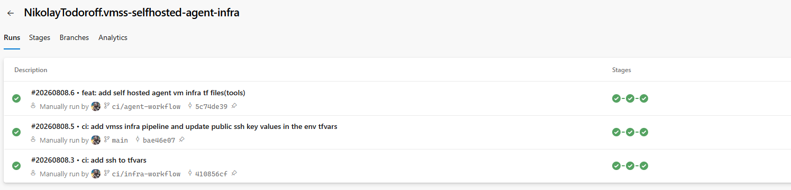
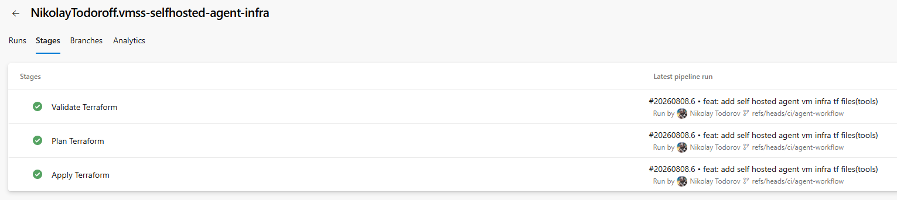

# vmss-selfhosted-agent-infra

Linux VM Scale Set behind a Standard Load Balancer with Azure Bastion, NAT Gateway, CPU-based autoscale, and a self-hosted Azure DevOps agent — deployed via multi-stage pipelines with manual approval gates and Azure Boards traceability.

---

## Highlights

- Linux VM Scale Set (Uniform orchestration) serving nginx behind a Standard Load Balancer, fully private with no public IPs on any instance
- Azure Bastion for SSH access; Azure NAT Gateway for explicit outbound connectivity (no implicit internet access on private subnets)
- CPU-based autoscale, validated live under real load
- Multi-stage Azure DevOps Pipeline — Validate, Plan, Apply — parameterized by target environment and plan-only/apply mode
- Manual approval gate on production deployments, backed by a self-hosted Azure DevOps agent
- Azure Key Vault (RBAC) and Azure Monitor (Log Analytics, Action Groups, Metric Alerts) for secrets and observability

---

## Pipeline Runs and Stages




---

## Repository Structure

```
vmss-azure-devops-infra/
├── infra/
│   ├── main/                        
│   ├── modules/
│   │   ├── networking/               
│   │   ├── compute/                  
│   │   ├── load-balancer/            
│   │   ├── key-vault/                
│   │   └── monitoring/               
│   ├── tools/                       
│   └── env/
│       ├── dev.tfvars
│       ├── prod.tfvars
│       ├── tools.tfvars
│       ├── dev.backend.hcl
│       ├── prod.backend.hcl
│       └── tools.backend.hcl
│   └── .tflint.hcl           
├── pipelines/              
│   └── vmss-infra.yml           
├── scripts/
│   ├── setup-agent.ps1
│   ├── bootstrap.sh
│   └── assign-roles.ps1
└── README.md
```

`infra/tools` is a self-contained Terraform root with its own state — it provisions the self-hosted pipeline agent and is applied locally, independent of `dev`/`prod`.

---

## CI/CD Architecture

### Infrastructure Pipeline

```
Validate
   ↓
Plan   (terraform plan → published as a pipeline artifact)
   ↓
Apply  (deployment job, environment-gated)
   ├── dev   → Microsoft-hosted agent, no approval required
   └── prod  → self-hosted agent, manual approval gate
```

Parameterized by `environment` (`dev`/`prod`) and `runApply` (boolean — unchecked plans only, nothing touches live infrastructure).

---

## Security

### Identity and Authentication

- Workload identity federation on the ARM service connection — no client secrets stored anywhere
- Key Vault in RBAC mode, `network_acls` deny-by-default with an explicit IP allowlist
- VMSS instances have no public IPs; SSH reachable only via Azure Bastion
- Self-hosted agent VM is internet-facing but NSG-restricted to a single trusted IP

### Security Tooling

| Tool | Purpose |
|---|---|
| TFLint | Terraform static analysis, run in the Validate stage |
| NSG deny-by-default | Network segmentation — workload subnet has no internet-facing inbound rules |
| Azure RBAC (Key Vault) | Data-plane access scoped via role assignment, not access policies |

---

## Monitoring

- Log Analytics Workspace
- Action Group with email notification
- Metric alerts on sustained VMSS CPU and Load Balancer backend health

---

## Key Design Decisions

- **Uniform VMSS orchestration over Flexible** — chosen to keep the deployment focused and limit the introduction of new platform concepts.

- **NAT Gateway separated from Load Balancer outbound traffic** — `disable_outbound_snat = true` prevents SNAT port contention between inbound and outbound flows.

- **Automatic rolling upgrades require a health probe** — `upgrade_mode = "Automatic"` depends on `health_probe_id` to determine instance health during upgrades.

- **Self-hosted agent bootstrapped outside the infrastructure pipeline** — an agent cannot execute the pipeline responsible for creating itself, so the initial provisioning is performed separately.

- **Self-hosted agent reserved for production deployments** — development uses disposable Microsoft-hosted agents, while production uses a persistent, controlled execution environment.

- **RSA SSH keys over Ed25519** — selected for broad compatibility across Azure Linux VMs and VMSS deployment scenarios.

---

## Technologies

- **Terraform** — IaC with modules pattern
- **Azure DevOps Pipelines** — multi-stage YAML, environment-gated approvals, self-hosted agent pool
- **.NET 8** — shared utility class library
- **Azure VM Scale Sets** — Uniform orchestration, Rolling upgrade mode
- **Azure Load Balancer** — Standard SKU, HTTP health probe
- **Azure Bastion** — browser-based SSH, no public IPs on workload VMs
- **Azure NAT Gateway** — explicit outbound for the private subnet
- **Azure Key Vault** — RBAC mode
- **Azure Monitor** — Log Analytics, Action Groups, Metric Alerts
- **TFLint** — Terraform static analysis

---
